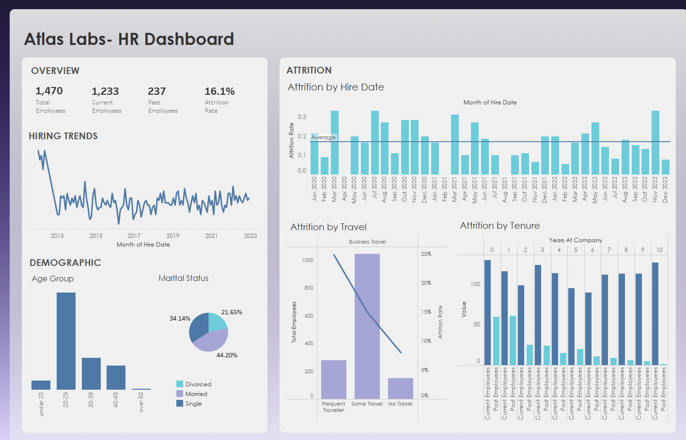

# Tableau HR Analytics Project

## Overview
This Tableau project explores a datset for a fictitious company called Atlas Labs, where I carried out exploratory data analysis and used calculated fields to build powerful visualizaions to create my dashboard.

Note: The file **Tableau HR Analytics.twbx** cannot be previewed on GitHub. To view the dashboard, click "View raw" to download it, then open it in Tableau Desktop or Tableau Reader.

## Data Source
Dataset: Education Level (CSV) , Employee (CSV), Performance Rating (CSV)

Source: [DataCamp] (https://app.datacamp.com/learn/courses/case-study-hr-analytics-in-tableau)

## Key Insights
- The attrition rate is 16.1% and a total of 237 employees have left Atlas Labs.
- Employees who frequently travel as part of thheir role have the highest attrition rate despite onlym making up 19% of total hires.
- Human resources recruiters and sales representatives have a signficantly high turnover rate.
 
## Preview

